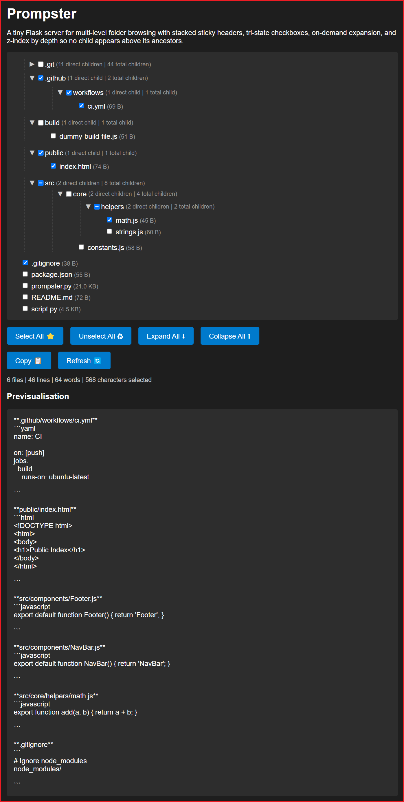

# prompster

Prompster: a vibe-coded Flask app to browse repos, select files or folders,
and copy a Markdown preview for LLMs. Read-only, non-critical.

## How to use

1. Copy the `prompster.py` file to the root of your codebase.
2. Make sure you have flask installed, and run `python prompster.py`.
3. Open [http://127.0.0.1:5000](http://127.0.0.1:5000) in your browser.
4. Select the files you want to show the LLM, and click "Copy".
5. Paste the result into your LLM.

## Screenshot

